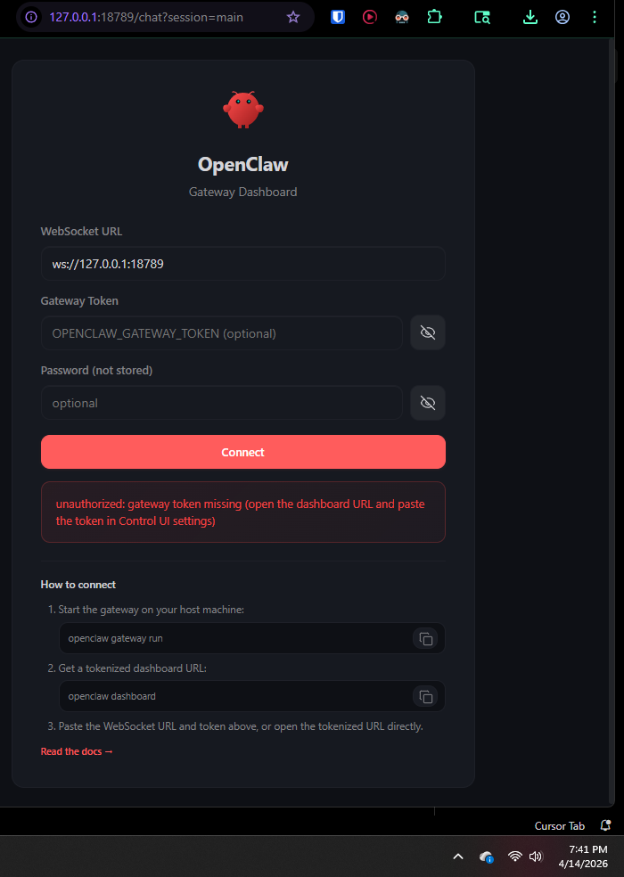

# PROGRESS MD
#### Tracking progress of openclaw setup. 


## Reference / Quick-access section

- [LOCALHOST CONTROL URL / GATEWAY DASHBOARD](http://localhost:18789/)
    - Dashboard screenshot
      
- GATEWAY TOKEN: aa6b063e906f2f4e3ce6e66669719b78a5838a827f57f3758aa941129c704413█
- Use ```docker ps``` to see health of active docker containers. (Docker image & containers are diff things.)
  - **Docker image** a frozen “snapshot” of your app and everything it needs to run (like a template)
  - **Docker container** a running copy of that image (like the app actually turned on and running)
  - E.G 
  ```cmd
  C:\Users\amodk\Documents\repos\Openclaw-setup>docker ps
  CONTAINER ID   IMAGE            COMMAND                  CREATED          STATUS                    PORTS                                                                     NAMES
  08cc50a5471b   openclaw:local   "docker-entrypoint.s…"   18 minutes ago   Up 18 minutes (healthy)   0.0.0.0:18789-18790->18789-18790/tcp, [::]:18789-18790->18789-18790/tcp   openclaw-openclaw-gateway-1
  ```

## Revisit in future 

### URGENT (Github configuration)
```bash
◇  Configure skills now? (recommended)
│  Yes
│
◇  Install missing skill dependencies
│  🐙 github
│
◇  Homebrew recommended ──────────────────────────────────────────────────────────╮
│                                                                                 │
│  Many skill dependencies are shipped via Homebrew.                              │
│  Without brew, you'll need to build from source or download releases manually.  │
│                                                                                 │
├─────────────────────────────────────────────────────────────────────────────────╯
│
◇  Show Homebrew install command?
│  Yes
│
◇  Homebrew install ─────────────────────────────────────────────────────╮
│                                                                        │
│  Run:                                                                  │
│  /bin/bash -c "$(curl -fsSL                                            │
│  https://raw.githubusercontent.com/Homebrew/install/HEAD/install.sh)"  │
│                                                                        │
├────────────────────────────────────────────────────────────────────────╯
│
◇  Install failed: github — brew not installed — Homebrew is not installed. Install it from https://brew.sh or install "gh" manually using your system package manager …
Tip: run `openclaw doctor` to review skills + requirements.
Docs: https://docs.openclaw.ai/skills
```


### OPTIONAL
<details>

◆  Gateway bind   
│  ● Loopback (127.0.0.1)  
│  ○ LAN (0.0.0.0)  
│  ○ Tailnet (Tailscale IP)  
│  ○ Auto (Loopback → LAN)  
│  ○ Custom IP


```MD 
## Network Mode Guidance

### Use LAN (recommended if you run OpenClaw in Docker on Windows)
Official Docker documentation defaults to LAN so your browser on the same machine can access:

- http://127.0.0.1:18789  
- http://localhost:18789  

This works with normal port publishing like `-p 18789:18789`.

Loopback inside containers can interfere with this model, so for Docker-based setups with a local control UI, **LAN is the correct choice**.

---

### Use Loopback when
- You are running the gateway directly on the host (not inside Docker)
- You only want it accessible on the current machine
- You do NOT need access from other devices on the network

This is the most restrictive / local-only option.

---

### Use Tailnet when
- You use Tailscale
- You want the gateway accessible via your tailnet IP
- You need secure remote access from other devices or locations

---

### Use Auto when
- You want OpenClaw to automatically choose the appropriate mode
- You are unsure about networking details

Note: For Docker + local UI setups, **LAN is still the most predictable and aligned with defaults**.

---

### Use Custom IP only if
- You specifically need to bind to a particular IP address
- You understand your network routing requirements

This is uncommon for first-time or standard setups.
```


</details>


### MISC / Informative output on setup completion 
```bash
Config warnings:
- plugins.entries.device-pair: plugin disabled (bundled (disabled by default)) but config is present
Config overwrite: /home/node/.openclaw/openclaw.json (sha256 1baf160fdbcfa408ab871f38579af170eb4d87821b2c726ce4caeb9f9fe80ad0 -> aee5188c0cc4974f9c75f831141617428e692240879aff86aec42366ecd1154f, backup=/home/node/.openclaw/openclaw.json.bak)
Config warnings:\n- plugins.entries.device-pair: plugin disabled (bundled (disabled by default)) but config is present
│
◇  Systemd ───────────────────────────────────────────────────────────────────────────────╮
│                                                                                         │
│  Systemd user services are unavailable. Skipping lingering checks and service install.  │
│                                                                                         │
├─────────────────────────────────────────────────────────────────────────────────────────╯
│
◇  Gateway ──────────────────────────────────────────────────────────────────────────────╮
│                                                                                        │
│  Gateway not detected yet.                                                             │
│  Setup was run without Gateway service install, so no background gateway is expected.  │
│  Start now: openclaw gateway run                                                       │
│  Or rerun with: openclaw onboard --install-daemon                                      │
│  Or skip this probe next time: openclaw onboard --skip-health                          │
│                                                                                        │
├────────────────────────────────────────────────────────────────────────────────────────╯
│
◇  Optional apps ────────────────────────╮
│                                        │
│  Add nodes for extra features:         │
│  - macOS app (system + notifications)  │
│  - iOS app (camera/canvas)             │
│  - Android app (camera/canvas)         │
│                                        │
├────────────────────────────────────────╯
│
◇  Control UI ──────────────────────────────────────────────────────────────────────────────────────╮
│                                                                                                   │
│  Web UI: http://172.18.0.2:18789/                                                                 │
│  Web UI (with token):                                                                             │
│  http://172.18.0.2:18789/#token=aa6b063e906f2f4e3ce6e66669719b78a5838a827f57f3758aa941129c704413  │
│  Gateway WS: ws://172.18.0.2:18789                                                                │
│  Gateway: not detected (connect failed: SECURITY ERROR: Cannot connect to "172.18.0.2"            │
│  over plaintext ws://. Both credentials and chat data would be exposed to network                 │
│  interception. Use wss:// for remote URLs. Safe defaults: keep gateway.bind=loopback and          │
│  connect via SSH tunnel (ssh -N -L 18789:127.0.0.1:18789 user@gateway-host), or use               │
│  Tailscale Serve/Funnel. Break-glass (trusted private networks only): set                         │
│  OPENCLAW_ALLOW_INSECURE_PRIVATE_WS=1. Run `openclaw doctor --fix` for guidance.)                 │
│  Docs: https://docs.openclaw.ai/web/control-ui                                                    │
│                                                                                                   │
├───────────────────────────────────────────────────────────────────────────────────────────────────╯
│
◇  Workspace backup ────────────────────────────────────────╮
│                                                           │
│  Back up your agent workspace.                            │
│  Docs: https://docs.openclaw.ai/concepts/agent-workspace  │
│                                                           │
├───────────────────────────────────────────────────────────╯
│
◇  Security ──────────────────────────────────────────────────────╮
│                                                                 │
│  Running agents on your computer is risky — harden your setup:  │
│  https://docs.openclaw.ai/security                              │
│                                                                 │
├─────────────────────────────────────────────────────────────────╯

◇  Web search ───────────────────────────────────────╮
│                                                    │
│  Web search was skipped. You can enable it later:  │
│    openclaw configure --section web                │
│                                                    │
│  Docs: https://docs.openclaw.ai/tools/web          │
│                                                    │
├────────────────────────────────────────────────────╯
│
◇  What now ─────────────────────────────────────────────────────────────╮
│                                                                        │
│  What now: https://openclaw.ai/showcase ("What People Are Building").  │
│                                                                        │

```